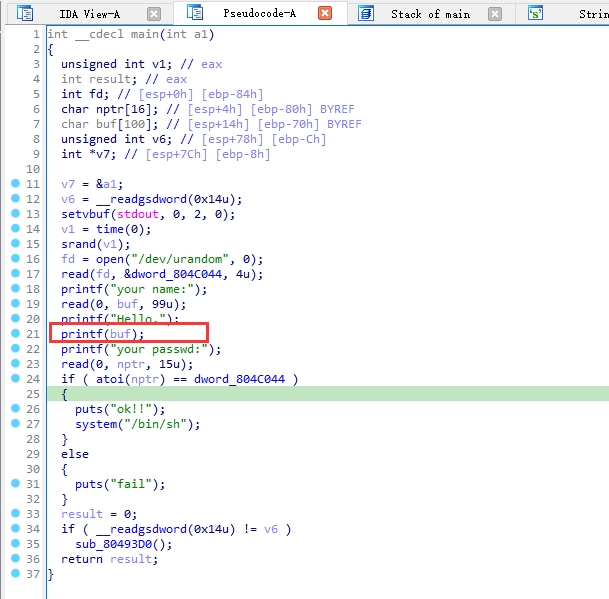
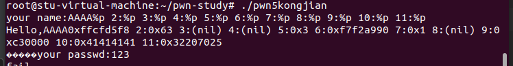

这是通过做题掌握二进制方向一些漏洞攻击手段的学习笔记，本笔记围绕buuctf平台

# [第五空间2019 决赛]PWN5

```sh
    Arch:     i386-32-little
    RELRO:    Partial RELRO
    Stack:    Canary found
    NX:       NX enabled
    PIE:      No PIE (0x8048000)
```

开启了金丝雀和栈不可执行的保护

看到代码，发现很明显的格式化字符漏洞



```
我们常用的参数格式
% x (% lx): 十六进制
% p: 指针形式
% s: 参数所指向的内存字符串
% n: 将格式化串中该特殊字符之前的字符数量写入参数中，获取参数的地址
```


这题有两个思路

1、利用格式化字符串改写dword_804C044之中的数据，然后输入和改写一样的数据，通过后续的正常逻辑比较拿到shell

通过测试我们得知我们输入的内容的偏移是在栈偏移10的位置




2、我们可以看到利用格式化字符串改写atoi的got地址，将其改为system的地址，配合之后的输入，拿到shell。

